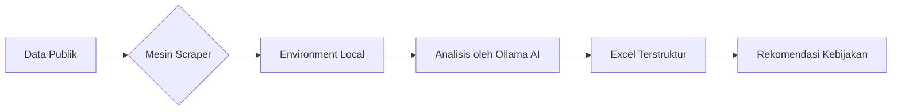

-----

#  ***Bandung Municipality's Phenomenon Scraper***


<br>
[](https://www.linkedin.com/in/anasyanf)
[](https://www.instagram.com/chiyeonas)
[](https://www.instagram.com/bps_kota_bandung)

**Bandung Municipality's Phenomenon Scraper** adalah ekosistem instrumen intelijen data terpadu yang dirancang untuk Badan Pusat Statistik (BPS). Alat ini bertujuan untuk mendeteksi, mengekstraksi, dan melakukan audit otomatis terhadap fenomena ekonomi; khususnya Ekspor, Impor, Logistik, dan Lembaga Non-Profit di wilayah Kota Bandung.

Sistem ini menggabungkan kekuatan **Asynchronous Web Scraping** dengan **Local Small Language Model (SLM)** untuk menjamin kedaulatan data dan akurasi analisis tanpa biaya API pihak ketiga.

-----

##  Misi Proyek

Membangun infrastruktur data yang mampu menjembatani celah antara rilis berita publik dengan realita administratif lapangan, guna meminimalisir asimetri informasi dalam pelaporan statistik kewilayahan. Dengan kata lain, proyek ini dibangun untuk mengatasi asimetri informasi dengan cara:
1. Mendeteksi anomali harga komoditas impor di tingkat pasar lokal.
2. Memvalidasi klaim publik dengan data manifest logistik (*Bill of Lading*).
3. Memantau aktivitas ekonomi lembaga non-pemerintah melalui parameter hibah dan donasi.
4. Menyediakan laporan audit yang memiliki bukti digital atau *audit trail* yang lengkap.

-----

## Struktur Proyek
```text
📁
.
├── config/             # Target & Konfigurasi (Disembunyikan .gitignore)
├── src/                # Inti mesin
│   ├── archive/        # Script BETA
│   └── *.py            # Scraping & AI Logic
├── data/               # Penyimpanan data lokal (Disembunyikan .gitignore)
├── .gitignore          # List file dan folder sensitif yang disembunyikan
├── LICENSE             # Lisensi MIT dalam 2 bahasa
└── README.md           # Dokumentasi serta deskripsi proyek
```

-----

## Alur Kerja Sistem



-----

## Development Roadmap
Proyek ini akan terus berkembang:

- [x] **Fase 1**: Mesin Scraping Inti (Instagram & News).
- [x] **Fase 2**: Integrasi AI Lokal (Ollama).
- [ ] **Fase 3**: Sistem Deteksi Anomali Otomatis.
- [ ] **Fase 4**: Visualisasi Dashboard (Seaborn/Matplotlib integration).

----


##  Katalog Instrumen Terpadu (Bandung Sentinel Ecosystem)

| Kategori | Nama Alat | Deskripsi Fungsi | Tujuan Utama |
| :--- | :--- | :--- | :--- |
| ***Investigation*** | `llama_scraper.py` | Flagship tool dengan integrasi Ollama. | Audit investigatif berita Ekspor/Impor Bandung. |
| | `lnprt_scraper.py` | Versi adaptasi untuk sektor lembaga sosial. | Mendeteksi hibah, donasi internasional, dan aktivitas LNPRT. |
| | `instagram_scraper.py` | Monitoring akun asosiasi & pelaku usaha. | Menangkap sentimen pasar dan tren logistik dari tangan pertama. |
| | `g4wb_scraper.py` | Ekstraktor data go4WorldBusiness. | Mencari profil eksportir dan importir aktif di wilayah Bandung. |
| | `BoL_scraper.py` | Pengambil data *Bill of Lading*. | Validasi arus barang fisik melalui dokumen pengapalan global. |
| | `main_comtrade.py` | Koneksi API UN Comtrade. | Penyediaan data pembanding (*baseline*) statistik internasional. |
| ***Utility & Auth*** | `auth_setup.py` | Pengelola login browser. | Mengamankan sesi login agar terhindar dari tantangan login berulang. |
| | `idx.py` | Pengelola entri data dan indeks. | Manajemen alur kerja dan pemetaan target sebelum ekstraksi. |
| | `cek_data_bol.py` | Pengecek integritas manifest. | Memastikan data *Bill of Lading* valid dan bebas duplikasi. |
| | `reverse_dork.py` | Mesin optimasi pencarian. | Menghasilkan parameter Google Dork yang presisi untuk meminimalkan *noise*. |
| ***Debugging*** | `llama_debug.py` | Lab pengujian Llama. | Menguji instruksi *prompt* dan format JSON tanpa *scraper* penuh. |
| | `news_debug.py` | Lab pengujian *parser* teks. | Menguji ketepatan ekstraksi (Ad-Killer) pada portal berita tertentu. |

---

##  Prasyarat Sistem

### 1\. Spesifikasi Rekomendasi Perangkat Keras (Hardware)

  * **GPU:** NVIDIA GTX 1630 (4GB VRAM) atau lebih tinggi (Penting untuk akselerasi Ollama).
  * **RAM:** Minimal 8GB.
  * **Penyimpanan:** SSD (disarankan untuk performa penulisan log asinkron).

### 2\. Spesifikasi Perangkat Lunak (Software)

  * **Python 3.11:** Versi ini wajib digunakan untuk stabilitas pustaka OCR dan deteksi *binary* browser.
  * **Ollama Server:** Terpasang dan sedang berjalan dengan model `bps-auditor`.
  * **Browser:** Microsoft Edge (untuk fitur *Organic Signature* melalui *profile copying*, artinya skrip akan gagal jika Edge tidak terinstal di lokasi standar).
  * **Tesseract OCR:** Wajib terinstal di Windows dan terdaftar di System Path (untuk scraping IG)

-----

##  Panduan Instalasi

### 1\. Isolasi Lingkungan (Virtual Environment)

Buat venv menggunakan Python 3.11
```bash
py -3.11 -m venv venv
```

Aktivasi venv
```bash
.\venv\Scripts\Activate
```

### 2\. Instalasi Pustaka Inti

Perbarui pip terlebih dahulu
```bash
python -m pip install --upgrade pip
```

Instalasi seluruh dependensi investigasi
```bash
pip install pandas playwright requests feedparser trafilatura openpyxl opencv-python numpy torch torchvision pytesseract Pillow opencv-python-headless pydantic newspaper3k xlsxwriter
```

### 3\. Konfigurasi Browser & AI

Instalasi binary browser Playwright
```bash
playwright install msedge
```

Pastikan model AI lokal sudah siap
```bash
ollama create bps-auditor -f Modelfile
```

-----

##  Cara Penggunaan (Eksekusi)

### A. Menjalankan Investigasi Berita Historis

Gunakan parameter rentang waktu untuk menarik data fenomena perdagangan di masa lalu:

```bash
python src/llama_scraper.py --mode history --start YYYY-MM-DD --end YYYY-MM-DD
```

### B. Menjalankan Radar Lembaga Non-Profit (LNPRT)

Sama seperti investigasi berita, namun dengan kamus kata kunci khusus lembaga sosial:

```bash
python src/lnprt_scraper.py --mode history --start YYYY-MM-DD --end YYYY-MM-DD
```

### C. Monitoring Akun Instagram Spesifik

```bash
python src/instagram_scraper.py --target nama_akun_asosiasi
```

-----

##  Output & Laporan

#### 📂 `data/exports/`

  * **Isi:** Berkas `.xlsx` yang sudah matang.
  * **Peran:** Ini adalah produk akhir dari `llama_scraper.py`. Berisi rangkuman anomali, skor relevansi, dan teks berita yang sudah dibersihkan dari elemen iklan oleh fungsi Ad-Killer. Adapun database `BPS_Social_Scraper/visited_urls.txt` berguna untuk mencegah pemrosesan ganda (Deduplikasi).

#### 📂 `data/raw/`

  * **Isi:** Berkas data raw dari berformat `.xlsx`.
  * **Peran:** Ini adalah produk akhir dari `instagram_scraper.py`. Berisikan username institusi yang didata, url postingan, path tangkapan layar postingan yang didata, caption postingan, serta teks hasil ocr postingan.

#### 📂 `data/logs/`

  * **Isi:** Tangkapan layar peramban di Instagram.
  * **Peran:** Digunakan untuk *troubleshooting* kode `IS_debug.py` yang merupakan versi debugging dari script `instagram_scraper.py`.

#### 📂 `data/media/`

  * **Isi:** Gambar dari Instagram, *screenshot* postingan, atau grafik yang diunduh.
  * **Peran:** Pendukung narasi audit. Untuk `instagram_scraper.py`, folder ini menyimpan bukti visual bahwa asosiasi dagang tertentu memang mengeluhkan harga logistik (penting karena postingan IG bisa dihapus oleh pemiliknya, tapi Anda sudah punya cadangannya).

#### 📂 `data/edge_workspace/`

  * **Isi:** Salinan sementara profil browser Edge.
  * **Peran:** Keamanan. Skrip bekerja di sini agar tidak merusak *history* atau *password* asli di browser utama.

-----

##  Catatan Keamanan & Etika

  * Skrip ini mengadopsi teknik User-Agent emulation dan sinkronisasi profil autentik untuk memitigasi risiko deteksi otomatis. Pendekatan ini memastikan interaksi dengan infrastruktur web target tetap berada dalam koridor perilaku manusia yang wajar (*human-like behavior*).
  * Implementasi kontrol konkurensi asinkron dibatasi secara ketat (maksimal dua instansi aktif) untuk menghormati kapasitas server target. Hal ini merupakan bentuk kepatuhan terhadap etika pengumpulan data publik guna mencegah degradasi performa pada sistem penyedia data serta menghindari pemblokiran IP oleh server.
  * Seluruh pemrosesan Small Language Model (SLM) dan ekstraksi informasi dilakukan secara lokal di perangkat. Tidak ada data mentah maupun hasil analisis investigasi yang ditransmisikan ke server pihak ketiga di luar yurisdiksi nasional, menjamin kerahasiaan penuh sesuai standar keamanan informasi BPS.
  * Penggunaan perangkat lunak ini ditujukan eksklusif untuk mendukung transparansi dan akuntabilitas sektor publik. Skrip ini tidak dirancang untuk menembus sistem keamanan yang diproteksi, melainkan untuk mengoptimalkan pengawasan data yang tersedia secara publik bagi kepentingan audit negara.

-----

***"In God we trust, all others must bring data." — W. Edwards Deming.***

*Dikembangkan untuk keperluan audit data Badan Pusat Statistik (BPS) Kota Bandung.*
